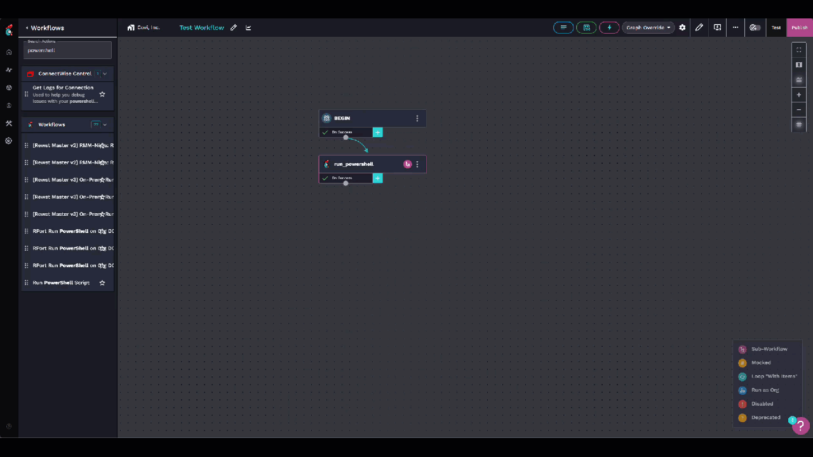

# Overview

Use this project and workflow to run raw PowerShell scripts directly in Azure Functions, rather than against a computer.

# Setup

1. Fork this repository.
1. Create a Function App in Azure. You'll need to name it something unique to your organization.

    

    Note: I have not tested this in Windows, but I'm sure it'll work just fine.

1. In your Function App in Azure, go to **Deployment Center** and connect it to the forked GitHub repository.
1. In Overview, copy your URL. You'll want to use this to create a default org variable in Rewst called `rewstps_az_functions_url`. The full URL if you want to test this outside of Rewst is: https://functionappname.azurewebsites.net/api/run.function/api/run.
1. Navigate to your function app in Azure, then go to Overview. Under functions, click **ScriptRunner**.
1. Under Function Keys, copy your default key and put it in another default org variable named `rewstps_az_functions_key`.
1. Import the `run-powershell-script.bundle.json` file as a new workflow.

# Usage

1. Create a script in Rewst called **Write-HelloRewst** with the following content:

```
'{{ CTX.hello }}' | ConvertFrom-JSON
```

Note that single quotes are important for passing objects since Rewst's `json_dump` filter will use double-quotes in the resulting string.

2. In a workflow on your BEGIN step, create a data alias called **hello** with the following value:

```
{{
    {
        "Hello": "Rewst"
    } |json_dump
}}
```

3. Add an action for the **Run PowerShell** workflow with your **Write-HelloRewst** as the script.

4. Test the workflow.



5. Notice that the result is returned as an object:


If you wanted to work with just strings, you could of course make your *hello* variable's value simply be {{ "world" }}. Then in your script, you'd just have the following:

```
"{{ CTX.hello }}"
```

If you're familiar with PowerShell, you may have noticed that we're able to get our output without doing anything explicit, such as posting data to a URL like in the Rewst example where we run scripts against endpoints. Because this is running directly in Azure as an API supported by PowerShell, we're able to return the full output of your script with REST, so anything that gets outputed in your script will be returned back to `{{ RESULT.result }}` automatically, just like a regular PowerShell script in your terminal.

In my testing, this means you can run almost anything that can run in Azure Functions. One example would be authenticating against resources in Azure by giving Azure Functions a Managed Identity.

# Avanan Example

I have not tested posting data, yet! If you try it, you'll want to pass your body like this:

```
{{
    {
        "foo": "bar"
    } | json_dump
}}
```

1. Add the following as default organization variables:
    - `avanan_app_id`
    - `avanan_app_secret`
1. Add the `Invoke-AvananRestMethod.ps1` script in the examples folder to your scripts in Rewst.
1. Import the **avanan_rest_api.bundle.json** in the workflows folder.
1. Test the imported workflow. Per the standard results from the Avanan SmartAPI, you should have your tenant data in `{{ RESULT.result.responseData }}`.